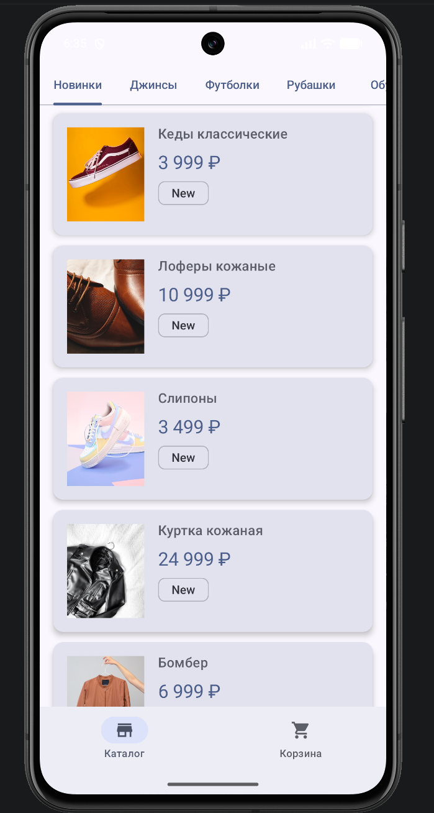
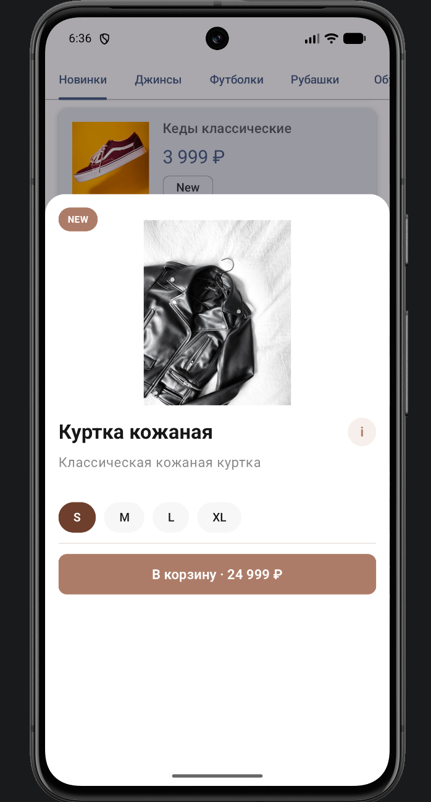
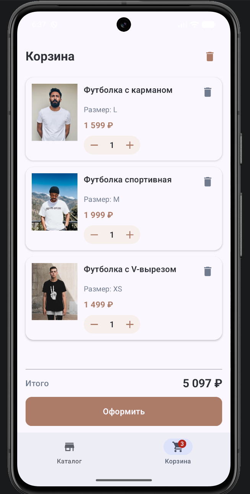

# Deuros 
---
## Описание

Deuros — мобильное Android-приложение интернет-магазина одежды и обуви. Пользователь может просматривать каталог, переключаться между категориями, открывать подробную карточку товара, выбирать размер, добавлять товары в корзину и оформлять заказ.

## Возможности

- загрузка каталога товаров из удалённого API;
- фильтрация товаров по категориям;
- карточки товаров с изображением, описанием, тегами и ценой;
- подробный экран товара в bottom sheet с выбором размера и характеристиками;
- корзина с изменением количества товаров, удалением позиций и очисткой;
- расчёт итоговой стоимости заказа;
- экран успешного оформления заказа.

## Скриншоты основных экранов

| Каталог | Карточка товара | Корзина |
|---|---|---|
|  |  |  |

> SVG-файлы в `docs/screenshots` можно заменить реальными PNG/JPG-скриншотами с эмулятора или устройства, сохранив те же названия файлов или обновив ссылки в таблице.

## Стек технологий

| Категория | Технология |
|---|---|
| Платформа | Android |
| Язык | Kotlin |
| UI | Jetpack Compose, Material 3 |
| Навигация | Navigation Compose |
| Загрузка изображений | Coil |
| Работа с JSON | Gson |
| Архитектура | MVVM, Repository |
| Сборка | Gradle Kotlin DSL |

## Требования

- Android Studio Narwhal/последняя стабильная версия или новее;
- JDK 17 или новее;
- Android SDK с `compileSdk 37` и `targetSdk 36`;
- устройство или эмулятор с Android 7.0+ (`minSdk 24`);
- доступ в интернет для загрузки каталога и изображений товаров.

## Команда и роли

- **Фронтенд-разработчик:** Юданов В. А.
- **Дизайнер:** Гордиенко К. В.
- **Бэкенд-разработчик:** Григалашвили Г. А.

---
# Инструкция по сборке и запуску
---
### 1. Клонировать репозиторий

```bash
git clone <URL-репозитория>
cd team-deuros
```

### 2. Открыть проект в Android Studio

1. Откройте Android Studio.
2. Выберите **File → Open**.
3. Укажите корневую папку проекта `team-deuros`.
4. Дождитесь синхронизации Gradle.

### 3. Запустить приложение из Android Studio

1. Выберите эмулятор или подключённое Android-устройство.
2. Нажмите **Run** для конфигурации `app`.
3. После установки откроется приложение Deuros.

### 4. Сборка из командной строки

Для Windows:

```powershell
.\gradlew.bat assembleDebug
```

Для macOS/Linux:

```bash
./gradlew assembleDebug
```

APK debug-сборки появится по пути:

```text
app/build/outputs/apk/debug/app-debug.apk
```

### Проверка проекта

```bash
.\gradlew.bat testDebugUnitTest
.\gradlew.bat connectedDebugAndroidTest
```

`connectedDebugAndroidTest` требует запущенный эмулятор или подключённое устройство.

## Структура проекта

```text
app/src/main/java/com/example/deuros/
├── data/          # модели и репозиторий каталога
├── ui/            # экраны, навигация, компоненты и тема
└── viewmodel/     # состояние каталога и корзины
```
